# 前言

## 问题

我们在使用各种打包工具，需要配置 `Babel`的时候，相信大家一开始都是直接在网上**复制粘贴**一段配置过来，然后能跑通就万事大吉了吧？因此，我们有时会遇到打包部署后，手机运行出现白屏问题；或者是，打包后代码包过大，加载缓慢等等问题。

其实这一切，大部分原因是因为我们对 `Babel`各项配置没有一个系统的理解，所以即使从网上复制粘贴了配置，出现问题了，不知道怎么去分析出现的问题。

## 准备

如果你已经对 `Babel`已经有一个大概的了解了，那阅读这篇文章，会让你对配置有一个更系统的了解；如果你才刚接触 `Babel`，或者对 `Babel`处于懵懵懂懂的状态，那我强烈建议你先阅读这篇文章——想弄懂Babel？你必须得先弄清楚这几个包 ^[1]^ ，它主要介绍分析了一些概念跟以下几个包：

* `@babel/core`
* `@bable/cli`
* `@bable/preset-env`
* `polyfill`
* `@babel/polyfill`
* `core-js`
* `@babel/runtime`
* `@babel/plugin-transform-runtime`

并且为我们答疑了一些看官网时的疑惑。因为在清楚了这几包后，我们学习配置这块会更容易理解一些。

## 备注

* 当前 `@babel/core`最新版本是：`7.20.12`
* 当前 `@babel/preset-env`最新版本是：`7.20.2`

# 再谈 `core-js`

通过上篇文章—— 想弄懂Babel？你必须得先弄清楚这几个包 ^[2]^ 我们知道：`core-js`是一种 `polyfill`，它提供了旧版本浏览器缺失的**所有**的 `ES6+` `API`的方法与实现。

在这里，以及下文，我们把通过引入 `core-js`的 **某个模块** ，来实现旧版本浏览器不支持的**某个** `ES6+` `API`的过程，叫做垫平。

我们看看 `core-js`这个包里面的主要一些模块：

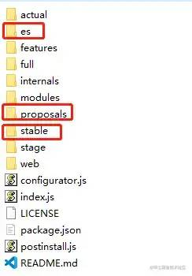

* `es`：里面只包含有稳定的 `ES`功能。
* `proposals`：里面包含所有 `stage`阶段的 `API`
* `stable`：它里面包含了，只有稳定的 `ES`功能跟网络标准

所以，我们可以这么使用：

* 当我们只需要垫平**某个**稳定的 `ES6+` `API`，我们可以用 `es`这个文件夹里的 `polyfill`来垫平 （`import X from 'es/xx'`）
* 当我们需要用到**提案阶段**的 `API`时，我就用 `proposals`这个文件夹里的 `polyfill`来垫平（`import X from 'proposals/xx'`）
* 当我们想垫平**所有稳定版本**的 `ES6+` `API`，可以导入用 `stable`文件夹（`import 'core-js/stable'`）
* 当我们想垫平**所有**的 `ES6+` `API`（包括提案阶段），可以直接 `import 'core-js'`

以上是我个人的使用习惯，因人而异，具体的介绍可以看看参考文章。

参考文章：core-js^[3]^

# 再谈 `@bable/preset-env`

通过上篇文章—— 想弄懂Babel？你必须得先弄清楚这几个包 ^[4]^ ，我们知道：

* `Babel`大体由两个功能组成：

  1. 编译 `ES6+`最新语法（`let`、`class`、`() => {}`等）
  2. 实现旧版本浏览器不支持的 `ES6+`的 `API`（`Promise`、`Symbol`、`Array.prototype.includes`等）
* `@babel/preset-env`有以下两个功能：

1. 它**只编译 `ES6+`语法**
2. 它并不提供 `polyfill`，但是可以通过**配置**我们代码运行的 **目标环境** ，从而控制 `polyfill`的导入跟语法编译，使 `ES6+`的新特性可以在我们想要的**目标环境**中顺利运行

* `@babel/plugin-transform-runtime`也有以下两个功能：

1. `@babel/runtime`跟 `@babel/plugin-transform-runtime`两者配合，可以减少打包体积
2. 也有一个配置功能，用来处理 `polyfill`如何垫平

* 如果我们想要在旧浏览器用到 `ES6+` `API`时，我们应该安装 `3`版本的 `core-js`（或者后续更高版本的）；

那我们可以很清楚的知道：

* 实现 `Babel`第一个功能：我们用 `@babel/preset-env`就可以了
* 实现 `Babel`第二个功能：我们就需要用 `core-js`这个包来提供 `polyfill`，并与 `@babel/preset-env`或者 `@babel/plugin-transform-runtime`的配置功能相互配合使用

我们先来看看 `@babel/preset-env`的配置项有哪些：

```js
// babel.config.js
const presets = [
    [
        '@babel/preset-env',
        {
            modules,
            targets,
            corejs,
            useBuiltIns,
            
            spec,
            loose,
            debug,
            bugfixes,
            include,
            exclude,
            forceAllTransforms,
            configPath,
            ignoreBrowserslistConfig,
            browserslistEnv,
            shippedProposals
        }
    ]
];
module.exports = {presets};
复制代码
```

我们可以看到配置项还是蛮多的（有一些配置项，后期可能会废弃），但是，其实我们平时项目中主要用到前四个配置，所以在这里我们重点来看看前四个配置（能不学的尽量不学，太累了）。

参考文章：\@babel/preset-env^[5]^

## `modules`

* 功能：启用 `ES`模块语法向另一种模块类型的转换
* 默认值：`auto`
* 可取的值：`"amd" | "umd" | "systemjs" | "commonjs" | "cjs" | "auto" | false`

当我们设置成 `false`的时候，`Babel`编译产生的一些辅助函数的引入方式会变成 `ES6`的模式引入（`import A from 'B'`）。

我们把 use-transform-runtime^[6]^ 这个案例 `Babel`配置改成以下配置，感受一下 `modules`这个配置的功能。

```js
// babel.config.js

const plugins = [
    '@babel/plugin-transform-runtime'
]

const presets = [
    [
        '@babel/preset-env',
        {
            modules: false
        }
    ]
];

module.exports = {plugins, presets};
复制代码
```

在**没设置 `modules`配置项**时，编译后的文件是：

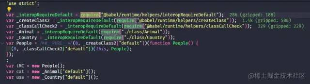

我们会发现辅助函数都是以 `require`的方式引入的；

在**设置了 `modules`配置项**后，编译后的文件是：

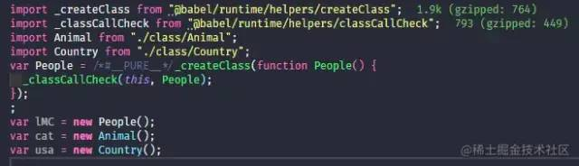

我们会发现辅助函数变成了我们熟悉的 `ES6`模块方式 `import`引入。

这样有一个好处，就是我们用一些像 `Webpack`打包工具时，可以对代码静态分析，很好地 `tree shaking`减少代码体积，所以我们配置 `Babel`的时候建议设置 `modules: false`

参考文章：modules^[7]^

## `targets`

### 作用

它的用法与 browserslist^[8]^ 一致。它可以用来设置我们的代码需要兼容的 **目标环境** ，因此它：

* 可以有效地减少 `ES6+`的语法编译
* 可以有效控制 `polyfill`导入多少

### 注意

#### 第一点

如果我们没有设置这个配置项时，它会去我们的 `Babel`配置文件找**顶层的** `targets`；如果顶层没有设置 `targets`，则会去我们的 `package.json`里的 `browserslist`或者根目录找 `.browserslistrc`；如果还没有则默认值为 `{}`。查找过程大致如下，序号代表查找顺序：

```js
// Babel配置文件
{
    targets: 'ie 10', // 2. 如果presets里面没有设置targets，会来这里查找
    presets: [
        [
            '@babel/preset-env',
            {
                targets: 'ie 9' // 1. 先在这里查找，没的话去顶层targets查找
            }
        ]
    ]
}

// package.json
{
    ...,
    browserslist: [
        'ie 11' // 3. 如果顶层targest里面没有设置，会来这里查找；如果这里也没设置，则为默认值{}
    ]
}
复制代码
```

#### 第二点

如果我们没有设置这个配置项时，`Babel`会假设我们要兼容的目标环境是最旧的浏览器，所以会将所有的 `ES6+`语法代码转化为 `ES5`。**所以我们配置 `Babel`的时候，要设置 `targets`以减少输出代码大小。**

针对这点，我们用这个案例 preset-env-targets-config^[9]^ 来感受一下：

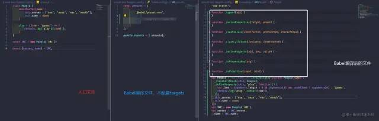

我们会发现 `ES6+`的写法全部被转成了 `ES5`，还加入了一些辅助函数（白色框）。

ok，我们设置 `targets: 'chrome 80'`。这表示，我们的代码是要在 `chrome 80`上运行的，再看看打包后的结果：

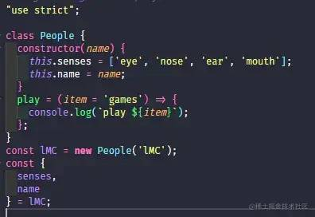

我们会发现编译出来的代码，跟我们入口文件写的代码基本没差。因为 `chrome 80`已经实现了入口文件代码的写法了。所以，**如果我们的代码不需要在一些比较低端的浏览器跑的话，设置 `targets`就十分有必要。**

参考文章：targets^[10]^

## `corejs`

当 `useBuiltIns`不为 `false`的时候，需要设置这个配置项

### 配置

它有两种配置方式：

1. 直接设置 `core-js`版本号

   ```js
   ...
   {
   useBuiltIns: 'usage',
   corejs: '3.27.2'
   }
   ...
   复制代码
   ```
2. 配置 `corejs`

   ```js
   ...
   {
   useBuiltIns: 'usage',
   corejs: {
       version: '3.27.2',
       // 是否编译提案阶段ES6+ API
       proposals: false
   },
   }
   ...
   复制代码
   ```

### 注意

1. 当我们的 `useBuiltIns`不为 `false`的时候，需要设置 `corejs`这个配置项
2. `2`版本的 `core-js`已经不建议使用了；我们用当然要用最新的，目前最新的版本是 `core-js@3.27.2`
3. **我们安装的 `core-js`要尽量保持最新，因为越新的包，包含的 `polyfill`才会越多**
4. 我们设置 `corejs`的版本号时，不要直接指定 `2`或者 `3`，它会被解析为 `2.0`或者 `3.0`。所以，我们应该带上 **子版本号** （`3.27.2`），这样才会有最新的 `polyfill`
5. `core-js`默认用**稳定版**的 `polyfill`来垫平，但如果有时我们想用还处在提案阶段的 `API`怎么办？

   * 如果我们配置的是 `useBuiltIns: entry`，我们得手动引入 `core-js`提案的 `polyfill`来垫平。 **提案的 `polyfill`放在 `core-js/proposals`文件夹中** （`import 'core-js/proposals/array-last'`）
   * 如果我们配置的是 `useBuiltIns: 'usage'`，则我们用上面说的 `corejs`模块里面提到的第二种配置方式，把 `proposals`设为 `true`就可以了

它的作用会结合下面的 `useBuiltIns`一起讲。

参考文章：targets^[11]^

## `useBuiltIns`

上面我们提到了，我们把通过引入 `core-js`的 **某个模块** ，来实现旧版本浏览器不支持的**某个** `ES6+` `API`的过程，叫做垫平。

 **这个配置就是用来设置我们 `core-js`的垫平方式的** 。它有下面三个值：

> 为了更好的理解，我们用 `Promise`这个 `ES6+` `API`作为下面的例子。我们都知道：
>
> * `IE 11`并不支持 `Promise`
> * `Promise`这个对象其实还有很多方法，例如 `Promise.any`、`Promise.all`、`Promise.finally`等。
> * 我们用这个案例 preset-env-useBuiltIns-config^[12]^ 来讲解

### `entry`

我们可以这么理解，`entry`中文是“进入”的意思，这个值说明我们的 `polyfill`应该是需要从某个**入口**引入来垫平。

#### 表现

**我们把配置设置为：`useBuiltIns: 'entry'`**

* 我们先来看看这个配置在 `IE 11`的表现形式，我们设置 `targets: 'ie 11'`：

  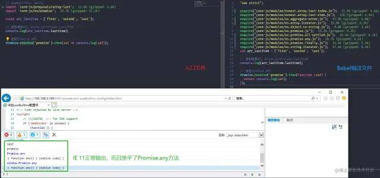
* 我们再把 `targets`设置成 `chrome: 80`看看表现：

  

#### 分析

* 在 `IE 11`的表现

  我们 `import 'core-js/es/promise'`（相当于 `import`某块 `polyfill`来垫平），由于我们的 `IE 11`不支持 `Promise`，所以 `useBuiltIns: 'entry'`配置把我们**所有**不支持的 `Promise`方法都垫平了（打印的 `window.Promise.any`有值）。
* 在 `chrome 80`表现

  我们 `import 'core-js/es/promise'`（相当于 `import`某块 `polyfill`来垫平）， 因为在 `chrome 80`中，`Promise`大部分方法已经实现，只有 `Promise.any`没有实现，所以此时只垫平了 `promise.any`方法。

#### 总结

所以我们可以总结出，它的执行原理大致是这样的：

1. 我们需要**手动** `import`**所有**或者**某块** `polyfill`
2. `Babel`会根据我们设置的 `targets`（目标环境），来判断我们手动 `import`的**所有**或者**某块** `polyfill`是不是当前缺失的
3. 如果是的话，就会把我们手动 `import`**所有**或者**某块** `polyfill`，拆分成很多小模块，**引入我们目标环境不支持的模块**

#### 注意

* 为了避免一些奇奇怪怪的问题，我们手动 `import`的 `polyfill`应该 **统一在入口文件** （我们现在的工程项目一般都会有一个入口文件）
* 如果我们想一劳永逸，直接把当前环境**所有**不支持的 `ES6+` `API`垫平，那我们就 `import 'core-js/stable'`（这会垫平当前 `targets`**不支持的所有稳定版本的 `ES6+` `API`**，所以也会导致包变大）
* 如果我们只想单纯垫平**某个** `ES6+` `API`（前提是 `targets`不支持这个 `API`，否则手动 `import`了也没用；例如只想垫平 `Promise`），那我们 `import 'core-js/es/promise`就可以了
* 如果想垫平提案阶段的 `API`，则也需要手动 `import`对应提案的 `polyfill`（`import "core-js/proposals/string-replace-all`）

参考文章：usebuiltins^[13]^

### `usage`

这个值的作用，就是我们不需要手动 `import`，它会自动帮我们 `import`当前 `targets`缺失的 `polyfill`。

#### 表现

**我们把配置设置为：`useBuiltIns: 'usage'`**

* 我们先来看看这个配置在 `IE 11`的表现形式，我们设置 `targets: 'ie 11'`：

  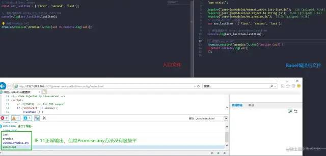
* 我们再把 `targets`设置成 `chrome: 80`看看表现：

  

#### 分析

* 在 `IE 11`的表现

  我们不用自己手动 `import`相关 `polyfill`，我们的代码中只用到了单一的 `Promise`对象，所以**只垫平**了 `Promise`这个对象，不会垫平它其他相关的方法（打印的 `window.Promise.any`无值）。
* 在 `chrome 80`的表现

  我们不用自己手动 `import`相关 `polyfill`，此时没有任何关于 `Promise`的垫平，因为单一的 `Promise`对象在 `chrome 80`已经实现，且我们代码中没有用 `Promise.any`方法，自然也就不会垫平 `Promise.any`。此时代码只垫平了提案阶段的 `array.lastItem`方法， **因为 `chrome 80`不支持它，并且我们代码中用到了它** 。

#### 总结

所以我们可以总结出，它的执行原理大致是这样的：

1. 我们**不需要手动** `import`**所有**或者**某块** `polyfill`
2. `Babel`会根据我们当前代码中用到的 `ES6+` `API`，并判断当前的 `targets`支不支持我们用到的这个 `ES6+` `API`
3. 如果不支持的话，则**自动导入这个 `ES6+` `API`对应的 `polyfill`**

因为它会自动导入，所以我们专注写我们的 `ES6+`就好了。

参考文章：usebuiltins^[14]^

### `false`

它是默认值。它表示不要在每个文件中自动添加 `polyfill`，也**不会根据 `targets`判断**缺不缺失，也不会将我们手动 `import`**所有**或者**某块** `polyfill`拆分为单个 `polyfill`引入。

#### 表现

**我们把配置设置为：`useBuiltIns: false`**

* 我们先来看看这个配置在 `IE 11`的表现形式，我们设置 `targets: 'ie 11'`：

  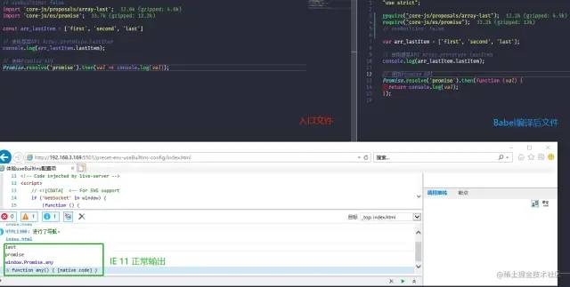
* 我们再把 `targets`设置成 `chrome: 80`看看表现：

  

#### 总结

`useBuiltIns`设置为 `false`:

* 对我们的垫平方式没作用，源码是什么样，输出就是什么样
* 设置 `targets`无效

参考文章：usebuiltins^[15]^

## 使用

### 适配 `IE 11`

相信通过上面的讲解，我们对各个配置项有个大概的了解了，那我们再更深入体验一下。

我们都知道 `IE 11`基本是不支持 `ES6+`的，我们抽几个常用的 `ES6+` `API`看看：

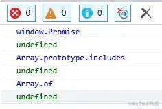

那我们就用 `IE 11`作为我们的 `targets`（目标环境），研究一下如何配置 `Babel`，使我们写的 `ES6+`代码能在 `IE 11`中跑起来。我们用这个案例 preset-env-template-config^[16]^

> 注意：为了避免 `Webpack`打包错误，我们把 `targets`写在 `package.json`中，这样 `Webpack`才能识别环境打包
>
> ```js
> ...
> "browserslist": [
>    "ie 11"
>  ]
>  ...
> 复制代码
> ```

我们用一下这段代码作为我们的入口文件：

```js
// 如果用`usage`方式，则注释掉这段代码
import 'core-js/stable';

const lMC = {
    name: 'limingcan',
    like: ['eat', 'drink', 'play', 'fun'],
    breath() {
        return new Promise(resolve => {
            setTimeout(() => resolve(), 1000)
        })
    }
};

lMC.breath().then(() => console.log('breath'));
console.log(lMC.like.includes('play'));
console.log(Array.of(1, 2, 3));
复制代码
```

根据我们上面几个配置项的讲解，如果我们想：

* 一劳永逸的直接垫平 `targets`所有不支持的 `ES6+` `API`，那我们的配置应该是：

  ```js
  const presets = [
    [
        '@babel/preset-env',
        {
            modules: false,
            useBuiltIns: 'entry',
            corejs: {
                version: '3.27.2',
                proposals: true
            }
        }
    ]
  ];
  module.exports = { presets};
  复制代码
  ```

  此时 `IE 11`正常输出：

  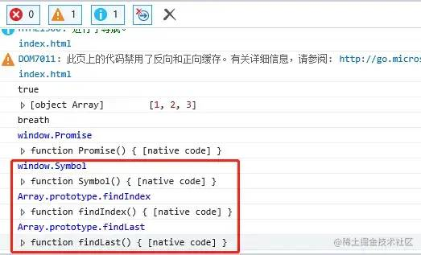

  红色框是我们源码中**没用到的** `ES6+` `API`，也都被垫平了；此时包的大小有 `115K`
* 如果我们想减少包的体积，只垫平我们用到的 `ES6+` `API`，那我们的配置应该是：

  ```js
  const presets = [
    [
        '@babel/preset-env',
        {
            modules: false,
            useBuiltIns: 'usage',
            corejs: {
                version: '3.27.2',
                proposals: true
            }
        }
    ]
  ];
  module.exports = { presets};
  复制代码
  ```

  此时 `IE 11`正常输出：

  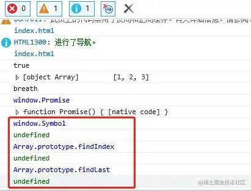

  但是我们会发现，红色框是我们源码中没用到的 `ES6+` `API`，它并没有被垫平的，它只会垫平我们代码中用到的 `API`；此时包的大小只有 `29K`

### 常见问题

通过上面的例子，我们会发现：

如果配置是 `useBuiltIns: 'entry'`

1. 我们垫平的 `polyfill`，都是注入到 `window`全局的，或者是某个内置对象的原型（`prototype`）上，这**影响到了全局**
2. 一劳永逸的方式会垫平当前 `targets`**所有不支持的 `ES6+` `API`**，这虽然方便，但这会导致**包变得很大**

如果配置是 `useBuiltIns: 'usage'`

1. 它也会将垫平的 `polyfill`注入到全局。
2. 由于 `useBuiltIns: 'usage'`是判断当前 `targets`支不支持我们代码中用到的 `ES6+` `API`，如果不支持会自己 `import`。
   那有这样一种情况，如果第三方库用到了我们当前 `targets`不支持的 `ES6+` `API`，但我们自己的代码没有用到这个 `API`，那么这个 `API`是不会被叠平的，这会导致我们项目报错。

### 第三方库问题

针对 `useBuiltIns: 'usage'`配置的第二点弊端，我们来看这个例子 use-third-party-library-problem^[17]^ 更直接的感受一下。

我们把 `targets`设为 `IE 11`，我们**自己的代码只用 `includes`这个 `ES6+` `API`**，然后再用第三方库 tars-utils^[18]^ 的 `optimizeImage`方法，生成一个 `Blob`对象（里面是用 `Promise`实现的 ^[19]^ ）。

我们在 `IE 11`跑一下看看：

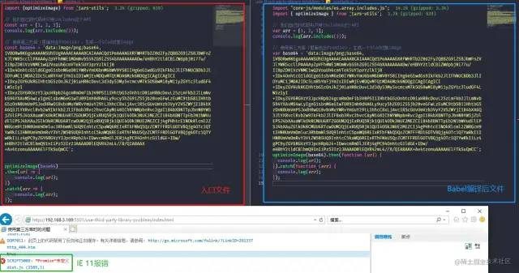

通过 `Babel`编译后的文件，我们会发现：

* 只有我们代码中使用的 `includes`方法被垫平；
* 第三方库中用到的 `Promise`并没有被垫平，所以导致 `IE 11`报错了。**这是一个非常现实的问题。**

我们在高级一点的浏览器（`chrome 108`）看看：


在 `chrome 108`运行没有任何问题，因为 `chrome 108`已经内部实现了 `Promise`。

## 总结

看到这里，相信我们对 `@babel/preset-env`的配置功能已经有个大概的了解了。上述所说的问题确实是我们很实际的问题。

因此，`useBuiltIns`设置 `entry`还是 `usage`，还是得根据我们项目实际需求来，我个人建议：

* 由于我们 `@babel/preset-env`配置方式，是会把当前 `targets`缺失的 `API` **注入到全局** ，所以这个配置方式是比较适合我们做的一些**前端工程项目**或者 **应用程序** 。如果对包的体积不是很在意，建议使用 `useBuiltIns: entry`的方式，然后再 `import 'core-js/stable'`，一劳永逸的垫平，这样可以帮我们避免掉一些奇怪的问题，
* 如果使用 `useBuiltIns: usage`，那还是得注意第三方库的问题。如果判断出哪块 `polyfill`缺失，我们可以自己手动 `import`去垫平

# 再谈 `@babel/plugin-transform-runtime`

上面说到，`@babel/preset-env`配置方式，是会把当前浏览器缺失的 `API` **注入到全局的** ，那么有没有不注入全局的办法呢？答案是有的。它就是我们接下来要讲的 `@babel/plugin-transform-runtime`配置。

我们先来看看它有几个配置项（谢天谢地，不算很多）：

```js
// babel.config.js
const plugins = [
    [
        '@babel/plugin-transform-runtime',
        {
            helpers,
            regenerator,
            corejs,
            
            version
        }
    ]
];
module.exports = {plugins};
复制代码
```

## `helpers` && `regenerator`

### 解析

我们先看前两个配置，因为前两个配置比较简单，我们放在一起讲。

* `helpers`默认值是：`true`
* `regenerator`默认值是：`true`

通过上篇文章——想弄懂Babel？你必须得先弄清楚这几个包 ^[20]^ ，我们知道：

**关于 `@babel/runtime`**

* `@babel/runtime`是**存放了 `Babel`辅助函数的一个集合包**

**关于辅助函数**

* 当我们只用了一些 `ES6+`语法糖的时候，`Babel`编译时会内联注入一些辅助函数
* `@babel/plugin-transform-runtime`与 `@babel/runtime`配合使用时，会将我们用到的辅助函数，从 `@babel/runtime`中以 `require`或者 `import`的方式，引入到我们的文件中，实现复用，从而减小我们最终输出包的体积。

**关于 `regenerator`**

* 我们的源码里面使用了 `async function() {}`等异步函数，或者 `fuction* myGenerator() {}`这种 `Generator`函数的话，就会需要用到 `regenerator-runtime`这个包来编译。
* `Babel >= 7.18.0`，`regenerator-runtime`包里的内容，会以 **局部变量的方式内联注入到我们的代码中** ，这样我们就不需要全局提供一个 `regeneratorRuntime`对象。

例如我们使用了 `class`语法糖跟 `async function() {}`，然后用 `@babel/runtime`跟 `@babel/plugin-transform-runtime`（默认情况下，`helpers`与 `regenerator`值为 `true`）配合使用，编译后如下图：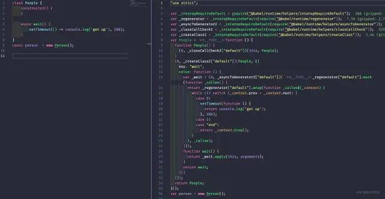

---

当我们把 `helpers`跟 `regenerator`的值设为 `false`：

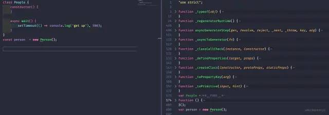

我们会发现我们的辅助函数，跟 `regenerator-runtime`这个包又变回了内联方式。所以：

* `helpers`：控制的是我们的辅助函数，**是否不内联**进我们的代码中。

  * `true`的话是不内联，而是引用 `@babel/runtime`辅助函数集合包
  * `false`的话，则会内联
* `regenerator`：与 `helpers`类似，控制的是我们 `regenerator-runtime`这个包的代码，**是否不内联**进我们的代码中。
* `true`的话是不内联，而是引用 `@babel/runtime`辅助函数集合包
* `false`的话，则会内联

### 注意

官网中关于 `regenerator`的解释，大致意思是：`regenerator`如果设为 `false`，需要我们提供一个全局的 `regeneratorRuntime`的对象。

但是：

* 当 `Babel >= 7.18.0`以后，`regenerator-runtime`包里的内容，会以 **局部变量的方式内联注入到我们的代码中** 。所以其实 `Babel >= 7.18.0` `regenerator`这个配置项个人觉得是基本没用了
* `Babel < 7.18.0`的话，则需要我们提供一个全局的 `regeneratorRuntime`的对象。相关案例可查看 import-regenerator-runtime ^[21]^ ，开启 `babel.config.js`相关注释代码。

## `corejs`

### 解析

`corejs`这个配置项一旦不为 `false`，就是用来设置我们的要垫平的 `ES6+` `API`，以**不污染全局局部变量方式垫平。**

它有三个值：

| 值                                                        | 对应依赖                   | 补充                                                                       |
| --------------------------------------------------------- | -------------------------- | -------------------------------------------------------------------------- |
| `false`（默认值）                                       | `@babel/runtime`         | ``                                                                  |
| `2`                                                     | `@babel/runtime-corejs2` | 1. 只能编译支持全局变量（如 `Promise`）和静态属性（如 `Array.from`）； |
| 2. 不能编译实例相关方法（`[].includes`）                | ``                  | ``                                                                  |
| `3`                                                     | `@babel/runtime-corejs3` | 1. 既能编译能编译支持全局变量和静态属性，又能编译实例方法                  |
| 2. 开启 `proposals: true`，还可以编译提案阶段的 `API` | ``                  | ``                                                                  |

我们用这个例子 transform-runtime-config^[22]^ 体验一下。

* 如果配置的是 `corejs: 2`的话，会怎么样：

  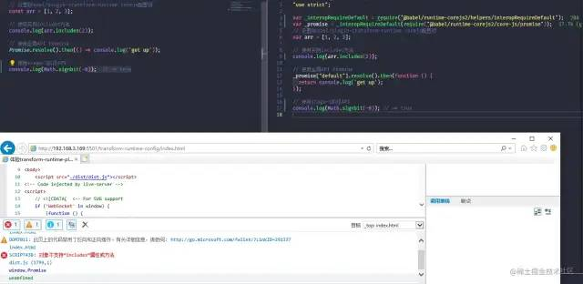

  我们会发现，实例方法 `includes`没被垫平，提案 `API`（`Math.signbit`）也没有被垫平；`Promise`是以局部变量的方式出现在我们的代码中。
* 我们再看看配置的是 `corejs: {version: 3, proposals: true}`：

  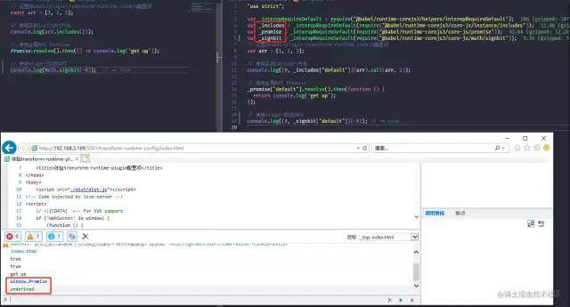

我们会发现，实例方法 `includes`被垫平，提案 `API`（`Math.signbit`）也垫平；但它们都以**局部变量**的方式注入。

 **所以，如果我们不想以全局的方式污染的方式垫平我们的 `ES6+` `API`，我们 `corejs`就不能为 `false`，并且优先使用 `@babel/runtime-corejs3`这个包来垫平** （设置为 `3`）

### 优化

上面的案例我们并没有设置 `targets`，所以 `@babel/plugin-transform-runtime`配置下，会把我们代码中用到的**所有** `ES6+` `API`都垫平。我们来设置 `targets`，看看能不能垫平我们的 `targets`不支持的 `ES6+` `API`。

我们在 `package.json`里面添加，或者在**配置文件的顶层**添加是可以的（ **经过测试，在 `@babel/preset-env`里面设置 `targets`是不行的** ）：

```js
// package.json
"browserslist": [
    "chrome 80"
]

// 或者在顶层添加
module.exports = {
    targets: {chrome: 80}, // 在这里添加
    presets: ['@babel/preset-env'],
    plugins: [
        [
            "@babel/plugin-transform-runtime",
            {
                ...
            }
        ]
    ]
}
复制代码
```

输出：

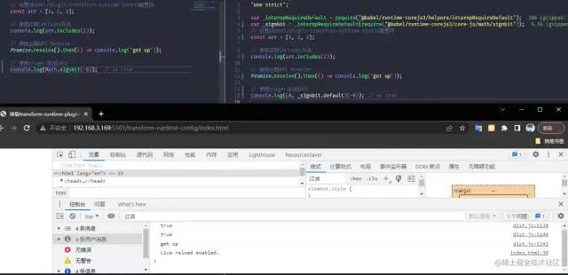

我们会发现，`Promise`跟 `includes`都没有被垫平，因为 `chrome 80`已经支持了

### 总结

* `@babel/preset-env`是以全局方式垫平，`@babel/plugin-transform-runtime`是以局部变量方式垫平，两者我们应该选择其一，不要又用 `@babel/preset-env`配置方式，又用 `@babel/plugin-transform-runtime`配置方式，这样肯定会出现一些奇奇怪怪的问题。
* 因为使用 `@babel/plugin-transform-runtime`垫平是以**局部变量的方式**来垫平，所以 `@babel/plugin-transform-runtime`这种配置方式更适合来做 **库** 的开发。它可以很好的帮我们的库与使用者的项目解耦。

参考文章：babel-plugin-transform-runtime^[23]^

## 其他

* 案例 preset-env-useBuiltIns-config^[24]^ 里面有个 `stage-1`阶段的提案 `API`—— Array.prototype.lastItem ^[25]^ （取数组最后一项）。本来是想用 `Array.prototype.uniqueBy`这个当前处在 `stage-1`的 `API`来给大家做例子的，结果发现编译以后在 `IE 11`有问题。所以给 `Babel`提了个 issues^[26]^ ：

  

  目前应该是修复了，在等合并。复现问题的代码包在 babel-use-proposals-problem ^[27]^ ，感兴趣的朋友也可以 `Fork`自己瞅瞅。说这个事主要也是想表达，学习还是不能停止（不是卷啊，还是要有学习的习惯）。
* 在讲 `@babel/plugin-transform-runtime`如何配置时，我们说到开启 `{version: 3, proposals: true}`时，可以以局部变量的方式对提案阶段的 `ES6+` `API`垫平。

  但是经过测试发现，有些提案阶段的 `API`，用这个方法似乎是不能按预期实现的，所以又提了个 issues^[28]^ ，有个 `Babel`之一的大佬说可以用 `babel-plugin-polyfill-corejs3`来实现：

  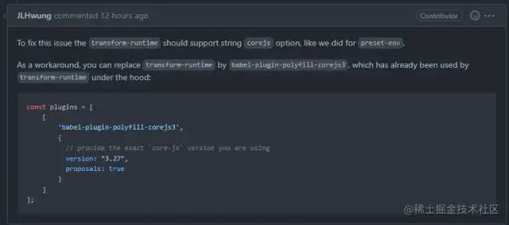

  关于 `babel-plugin-polyfill-corejs3`这块，其实 `Babel`还有一种垫平配置方式，是使用 babel-polyfills^[29]^ 这个包来实现的，这块后期再看看要不要出文章聊聊。

## 最后

通过以上的了解，我们最后来总结一下这个配置。

* 如果我们开发的项目是 **应用程序** ，或者 **大型的项目** ，那我们可以这么配置：
  ```js
  // Babel配置
  const presets = [
    [
        '@babel/preset-env',
        {
            modules: false,

            // 或者只想用垫平我们代码中用到的 --> useBuiltIns: 'usage',
            useBuiltIns: 'entry',
            corejs: {
                version: '3.27.2',
                proposals: true
            }
        }
    ]
  ];
  const plugins = [
    '@babel/plugin-transform-runtime'
  ];
  module.exports = {plugins, presets};

  // package.json
  {
    ...,
    // 设置目标环境
    "browserslist": [
        "ie 11"
    ]
  }

  // 入口文件
  // ---- useBuiltIns: 'entry'时，需要引入以下----
  // 垫平全部ES6+稳定版API
  import 'core-js/stable'; 
  // ---- 或者 -----
  // 垫平所有ES6+ API，包括提案阶段
  import 'core-js';
  复制代码
  ```

---

* 如果我们是想开发一个 **第三方库** ，我们可以这么配置：
  ```js
  // Babel配置
  const presets = [
    [
        '@babel/preset-env',
        {
            modules: false
        }
    ]
  ];
  const plugins = [
    [
        '@babel/plugin-transform-runtime',
        {
            corejs: {
                version: 3,
                proposals: true
            }
        }
    ]
  ];
  module.exports = {plugins, presets};

  // package.json
  {
    ...,
    // 设置目标环境
    "browserslist": [
        "ie 11"
    ]
  }

  // 入口文件
  const Method = {
    wait(delay) {
        return new Promise(resolve => setTimeout(() => resolve(), delay);
    }
  }
  ...
  复制代码
  ```

文章涉及到的例子，已经上传 [Github](https://link.juejin.cn/?target=https%3A%2F%2Fgithub.com%2Flimingcan562%2Flearn-babel-7 "https://github.com/limingcan562/learn-babel-7")，觉得有帮助的话，欢迎 `Star`或者 `Fork`学习。

如果读完这篇文章的你，觉得真的有帮助到， **欢迎点赞收藏** ；如果有异同点， **欢迎在评论区讨论** 。

关于本文

# 作者：前端切圖仔

https://juejin.cn/post/7197666704435920957
