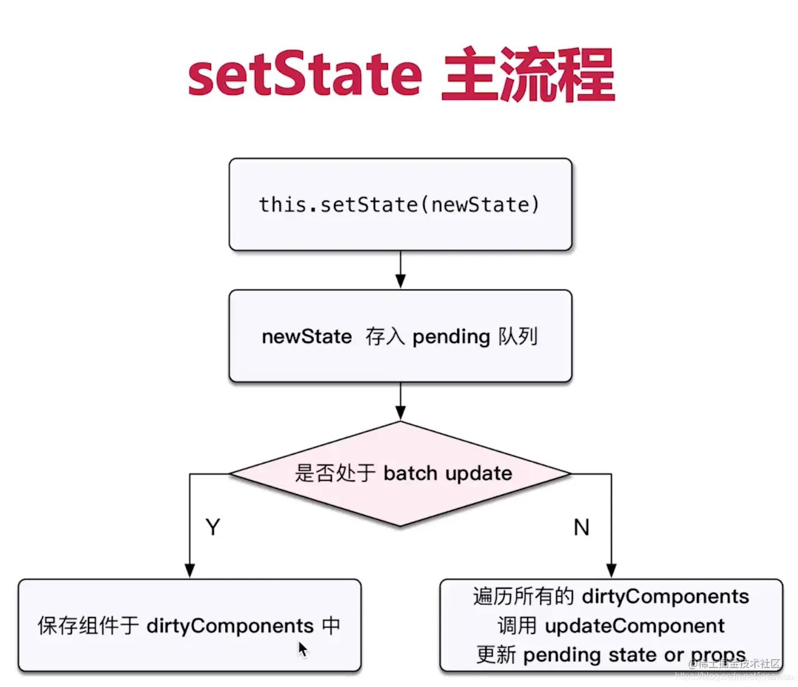

> 链接：https://juejin.cn/post/7069399397661933599
> 来源：稀土掘金

### 对React中的setState的理解？

* setState这个方法在调用的时候是同步的，但是引起React的状态更新是异步的 【React状态更新是异步的】
* setState第一个参数可以是一个对象，或者是一个函数，而第二个参数是一个回调函数

### setState第二个参数的作用？

因为setState是一个异步的过程，所以说执行完setState之后不能立刻更改state里面的值。如果需要对state数据更改监听，setState提供第二个参数，就是用来监听state里面数据的更改，当数据更改完成，调用回调函数，用于可以实时的获取到更新之后的数据

### 为什么setState设计为异步的？

* setState设计为异步，可以显著的提升性能：如果每次调用setState都进行一次更新，那么意味着render函数会被频繁调用，界面重新渲染，这样效率是很低的；最好的办法应该是获取到多个更新，之后进行批量更新；
* 如果同步更新了state，但是还没有执行render函数，而且peops依赖于state中的数据，那么state和props不能保持同步；pstate和props不能保持一致性，会在开发中产生很多的问题；

### 当你调用setState的时候，发生了什么事？

1. 将传递给 setState 的对象合并到组件的当前状态，触发所谓的调和过程（Reconciliation）
2. 然后生成新的DOM树并和旧的DOM树使用Diff算法对比
3. 根据对比差异对界面进行最小化重渲染

### 批量更新的问题？

先给出一个例子：

```js
import React, { Component } from 'react'

class App extends Component {
  state = {
    count: 1,
  }

  handleClick = () => {
    this.setState({
      count: this.state.count + 1,
    })
    console.log(this.state.count) // 1

    this.setState({
      count: this.state.count + 1,
    })
    console.log(this.state.count) // 1

    this.setState({
      count: this.state.count + 1,
    })
    console.log(this.state.count) // 1
  }
  render() {
    return (
      <>
        <button onClick={this.handleClick}>加1</button>
        <div>{this.state.count}</div>
      </>
    )
  }
}

export default App

```


点击按钮触发事件，打印的都是 1，页面显示 count 的值为 2

**在异步中：**

* 对同一个值进行多次 setState， setState 的批量更新策略会对其进行覆盖，取最后一次的执行结果
* 如果是同时 setState 多个不同的值，在更新时会对其进行合并批量更新。

上述的例子，实际等价于如下：

`Object.assign( previousState, {index: state.count+ 1}, {index: state.count+ 1}, ... )`

由于后面的数据会覆盖前面的更改，所以最终只加了一次

 **如果是下一个state依赖前一个state的话，推荐给setState一个参数传入一个function** ：

```js
onClick = () => {
    this.setState((prevState, props) => {
      return {count: prevState.count + 1};
    });
    this.setState((prevState, props) => {
      return {count: prevState.count + 1};
    });
}

```


### setTimeout

```js
import React, { Component } from 'react'

class App extends Component {
  state = {
    count: 1,
  }

  handleClick = () => {
    this.setState({
      count: this.state.count + 1,
    })
    console.log(this.state.count) // 1

    this.setState({
      count: this.state.count + 1,
    })
    console.log(this.state.count) // 1

    setTimeout(() => {
      this.setState({
        count: this.state.count + 1,
      })
      console.log(this.state.count) // 3
    })
  }
  render() {
    return (
      <>
        <button onClick={this.handleClick}>加1</button>
        <div>{this.state.count}</div>
      </>
    )
  }
}

export default App

```

点击按钮触发事件，发现 setTimeout 里面的 count 值打印值为 3，页面显示 count 的值为 3。setTimeout 里面 setState 之后能马上能到最新值。

在 setTimeout 里面，setState 是同步的；经过前面两次的 setState 批量更新，count 值已经更新为 2。在 setTimeout 里面的首先拿到新的 count 值 2，再一次 setState，然后能实时拿到 count 的值为 3。


### DOM 原生事件

```js
import React, { Component } from 'react'

class App extends Component {
  state = {
    count: 1,
  }

  componentDidMount() {
    document.getElementById('btn').addEventListener('click', this.handleClick)
  }

  handleClick = () => {
    this.setState({
      count: this.state.count + 1,
    })
    console.log(this.state.count) // 2

    this.setState({
      count: this.state.count + 1,
    })
    console.log(this.state.count) // 3

    this.setState({
      count: this.state.count + 1,
    })
    console.log(this.state.count) // 4
  }

  render() {
    return (
      <>
        <button id='btn'>触发原生事件</button>
        <div>{this.state.count}</div>
      </>
    )
  }
}

export default App

```


点击按钮，会发现每次 setState 打印出来的值都是实时拿到的，不会进行批量更新。

在 DOM 原生事件里面，setState 也是同步的。

> 而在setTimeout或者原生dom事件中，由于是同步的操作，所以并不会进行覆盖现象

### 为什么建议传递给 setState 的参数是一个 callback 而不是一个对象？

* setState它是一个异步函数，他会合并多次修改，降低diff算法的比对频率。这样也会提升性能。
* 但更新是异步的，不能依赖它们的值去计算下一个 state。而setState 中函数写法的 preState 参数，总是能拿到即时更新（同步）的值。


### 我们在面试中经常会遇到以下的问题？

```js
class Example extends React.Component{
    constructor(){
    super(...arguments)
        this.state = {
            count: 0
        };
    }
    componentDidMount(){
       // a
      this.setState({count: this.state.count + 1});
      console.log('1:' + this.state.count)
      // b
      this.setState({count: this.state.count + 1});
      console.log('2:' + this.state.count)
      setTimeout(() => {
        // c
        this.setState({count: this.state.count + 1});
        console.log('3:' + this.state.count)
      }, 0)
      // d
      this.setState(preState => ({ count: preState.count + 1 }), () => {
        console.log('4:' + this.state.count)
      })
      console.log('5:' + this.state.count)
      // e
      this.setState(preState => ({ count: preState.count + 1 }))
      console.log('6:' + this.state.count)
    }
}

```

思考一下，你的答案是什么？？？

```js
1:0
2:0
5:0
6:0
4:3
3:4
```


你的答案是否正确？你又是否理解为什么会出现上面的答案？接下来我们就来仔细分析一下。

首先我们需要关注 setState 这个API，这个可以说是 React 中最重要的一个 API。

`setState(updater, [callback])`

setState 可以接受两个参数，第一个参数可以是一个对象或者是一个函数，都是用来更新 state。第二个参数是一个回调函数（相当于Vue中的$NextTick ），我们可以在这里拿到更新的 state。

在上面的代码中，【a，b，c】的 setState 的第一个参数都是一个对象，【e，f】的 setState 的第一个参数都是函数。

首先，我们先说说执行顺序的问题。

【1，2，5，6】最先打印，【4】在中间，最后打印【3】。因为【1，2，5，6】是同步任务，【4】是回调，相当于 NextTick 微任务，会在同步任务之后执行，最后的【3】是宏任务，最后执行。

接下来说说打印的值的问题。

在【1，2，5，6】下面打印的 state 都是0，说明这里是异步的，没有获取到即时更新的值；

在【4】里面为什么打印出3呢？

首先在【a，b】两次 setState 时，都是直接获取的 this.state.count 的值，我们要明白，这里的这个值有“异步”的性质（这里的“异步”我们后面还会讲到），异步就意味着这里不会拿到能即时更新的值，那每次 setState 时，拿到的 this.state.count 都是0。

在【d，e】两个 setState 时，它的参数是函数，这个函数接收的第一个参数 preState (旧的 state )，在这里是“同步”的，虽有能拿到即时更新的值，那么经过【a，b】两次 setState （这里类似于被合并），这里即时的 count 还是1。因为上面我们说过的执行顺序的关系，再经过【d，e】两次 setState ，所以 count 变成了3。

那么在【3】中打印出4又是为什么？你不是说了在 this.state.count 中拿到的值是“异步”的吗，不是应该拿到0吗，怎么会打印出4呢？

**那么要说明白这个问题，我们就得来聊聊 react 的 batchUpdate 机制了:**

> 在 React 的 setState 函数实现中，会根据一个变量 isBatchingUpdates 判断是直接更新 this.state 还是放到队列中回头再说，而 isBatchingUpdates 默认是 false，也就表示 setState 会同步更新 this.state，但是，有一个函数 batchedUpdates，这个函数会把 isBatchingUpdates 修改为 true，而当 React 在调用事件处理函数以及生命周期函数之前就会调用这个 batchedUpdates，造成的后果，就是由 React 控制的事件处理过程 setState 不会同步更新 this.state。

我们先看下面的图，可以简单理解为在 setState 时，如果处于 batch update 就走左边的流程（异步，拿不到即时的值），如果不是就走右边的流程（同步，能拿到即时的值）。那么怎么判断是否处于 batch update 呢？



React 的 batchUpdate 机制会在每一个方法执行之前设置一个 isBatchingUpdate 为 true，在方法执行结束之后设置 isBatchingUpdate 为 false 。那么当在执行 setState 这句代码的时候，如果 isBatchingUpdate 是 true，就命中了 batchUpdate 机制，会进行 “异步更新”；反之则是 “同步更新”。

**每当 React 调用 batchedUpdate 去执行更新动作时，会先把 `isBatchingUpdates`置为 true，表明正处于批量更新过程中。**

* 判断组件是否处于批量更新模式，如果是，即 `isBatchingUpdates`为 true 时，不进行 state 的更新操作，而是将需要更新的组件添加到 `dirtyComponents`数组中；
* 如果不是处于批量更新模式，则对所有队列中的更新执行 `batchedUpdates`方法

```js
method() {
    isBatchingUpdate = true;
    // 你需要执行的一些代码
    // ...
    isBatchingUpdate = false
}
```


那么在上面的那个面试题中，在 setTimeout 执行的时候 isBatchingUpdate 是 false ，没有命中 batchUpdate 机制，所以同步更新，这里的 this.state.count 已经是 3 了，所有在【3】中打印的就是 4。

```js
componentDidMount(){
    isBatchingUpdate = true
    setTimeout(() => {
      // c
      // 由于执行顺序的原因，在这里 isBatchingUpdate 已经是 false 了，所以同步更新
      this.setState({count: this.state.count + 1});
      console.log('3:' + this.state.count)
    }, 0)
    isBatchingUpdate = false
}

作者：芒果炒香菜
链接：https://juejin.cn/post/7069399397661933599
来源：稀土掘金
著作权归作者所有。商业转载请联系作者获得授权，非商业转载请注明出处。
```


以上是这个面试题的问题。还有一些 react 中自定义的 DOM 事件，同样是异步代码，也遵循这个 batchUpdata 机制，明白了这其中的原理，啥面试题都难不住我们。

### 使用原则是什么？

* 如果新状态不依赖于原状态【使用对象方式】
* 如果新状态依赖于原状态 【使用函数方式】
* 如果需要在setState()执行后，获取最新的状态数据，可以在第二个callback函数中读取到异步更新的最新值
* 在组件生命周期或React合成事件中，setState是异步；
* this.state是否异步，关键是看是否命中 batchUpdata 机制，命中就异步，未命中就同步。
* setState 中的 preState 参数，总是能拿到即时更新（同步）的值。
* 在setTimeout或者原生dom事件中，setState是同步；
* 不要直接修改state中的引用数据

 **文章参考** ：

[blog.csdn.net/josavion/ar…](https://link.juejin.cn?target=https%3A%2F%2Fblog.csdn.net%2Fjosavion%2Farticle%2Fdetails%2F113555018 "https://blog.csdn.net/josavion/article/details/113555018")

[segmentfault.com/a/119000003…](https://link.juejin.cn?target=https%3A%2F%2Fsegmentfault.com%2Fa%2F1190000039077904 "https://segmentfault.com/a/1190000039077904")
