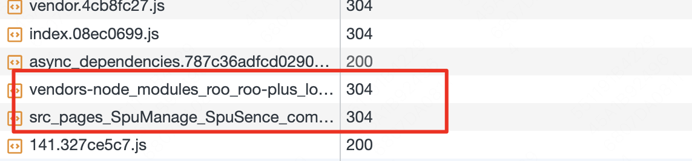

### 场景1：异步加载组件

1. 会进行代码分割，格外打包出异步组件脚本：业务组件 + 第三方库
2. 加载异步脚本会展示 loading



```js
import React, { useState, useEffect, Suspense, lazy } from 'react'
import {
  listSpu,
} from './api'

const LazyComponent = lazy(() => import('./SpuSence/components/SpuItem'))

// 场景1：一步加载组件
export default function App () {
  const [spuList, setspuList] = useState([])
  const params = {
    status: -1,
    shopId: 78446,
    shopCategoryId: 47586
  }
  const fetchSpuList = () => {
    listSpu(params)
      .then((data) => {
        const spuList = (data && data.spuList) || []
        setspuList(spuList)
      })
  }

  useEffect(() => {
    fetchSpuList()
  }, [])

  return (
    <Suspense fallback={<h2>loading...</h2>}>
      <h2>Suspense - LazyComponent</h2>
      <div>
        {
          spuList.map((spu, index) => (
            <LazyComponent key={index} spu={spu}/>
          ))
        }
      </div>
    </Suspense>
  )
}
```

### 场景2：加载数据，展示 loading

1. 初始化 cache 存储 promise
2. 每次发起请求都会先查 cache 是否有缓存，没有就进行请求，并把 promise 存到 cache，抛出 throw promise 到 Suspense 进行接收，当前 promise 处于 pending 状态，Suspense 展示fallback 属性的组件
3. promise 返回结果后，存储结果到 promise
4. 当 Suspense 接受 promise 状态转变为非 pending，Suspense 渲染 children
5. Suspense 中的 children 组件进行渲染，由于 promise 状态为非 pending，获取存储在promise的数据进行渲染

```js
import React from 'react'
import SpuItem from './SpuSence/components/SpuItem'
import {
  listSpu,
} from './api'

let cache = new Map()

async function getData () {
  const params = {
    status: -1,
    shopId: 78446,
    shopCategoryId: 47586
  }
  return await listSpu(params)
}

export function fetchData (query) {
  if (!cache.has(query)) {
    cache.set(query, getData(query))
  }
  return cache.get(query)
}

export default function SearchResults ({ query }) {
  if (query === '') {
    return null
  }
  const data = use(fetchData(query))
  const spuList = (data && data.spuList) || []
  if (spuList.length === 0) {
    return (
      <p>
        No matches for <i>"{query}"</i>
      </p>
    )
  }
  return (
    <div>
      {
        spuList.map((spu, index) => (
          <SpuItem key={index} spu={spu}/>
        ))
      }
    </div>
  )
}

function use (promise) {
  if (promise.status === 'fulfilled') {
    return promise.value
  } else if (promise.status === 'rejected') {
    throw promise.reason
  } else if (promise.status === 'pending') {
    throw promise
  } else {
    promise.status = 'pending'
    promise.then(
      (result) => {
        promise.status = 'fulfilled'
        promise.value = result
      },
      (reason) => {
        promise.status = 'rejected'
        promise.reason = reason
      }
    )
    throw promise
  }
}
```
